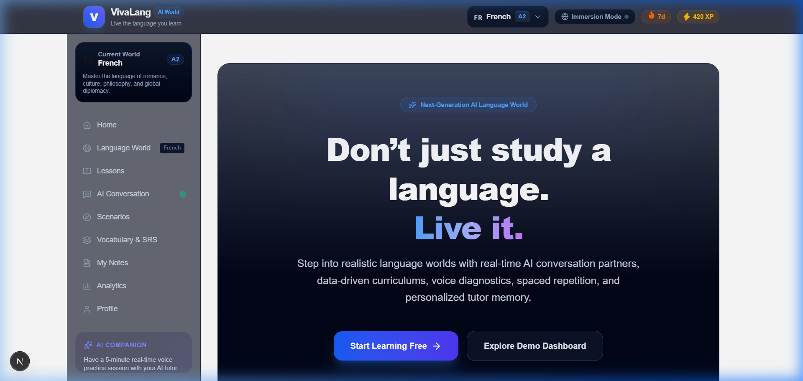
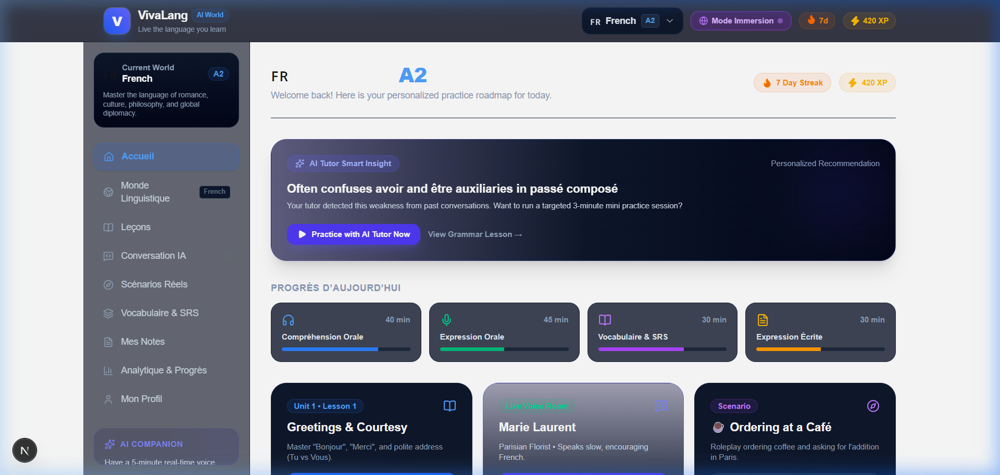
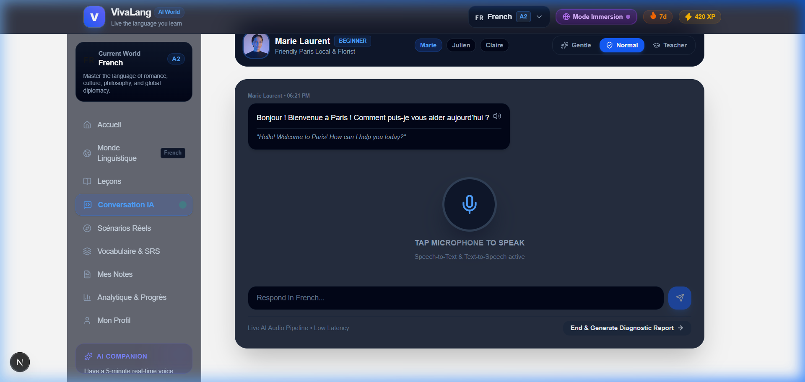

# VivaLang — AI Language Learning Platform 🌍🤖

[](https://nextjs.org/)
[](https://reactjs.org/)
[](https://www.typescriptlang.org/)
[](https://tailwindcss.com/)
[](LICENSE)

> **Philosophy**: *"Don't just study a language. Live it."*

VivaLang is a full-stack, startup-quality AI language-learning platform that replaces static chatbot boxes with **data-driven language worlds**. Learners explore CEFR-aligned curriculums, engage in real-time voice conversations with AI personas, practice real-world roleplay scenarios, review vocabulary via SM-2 Spaced Repetition, and use an AI-assisted notes workspace.

---

## 📸 Visual Demo & Screenshots

### 1. Landing Page Overview


### 2. Daily Action Center & Immersion Mode (`/home`)


### 3. Real-Time AI Conversation Room & Voice Waveform (`/conversation`)


---

## ✨ Core Features & Highlights

### 🎙️ 1. Interactive AI Conversation Room
- **Voice State Waveform**: Real-time visual feedback (`LISTENING` 🎙️, `THINKING` 🤔, `SPEAKING` 🔊) using Web Speech API STT & TTS.
- **Native AI Personas**: *Marie Laurent* (Parisian Florist), *Julien Moreau* (Barista), *Claire Dubois* (Journalist), *Anna Schneider* (Munich Baker), *Lukas Weber* (Berlin Engineer), and *Dr. Thomas Hoffmann* (Professor).
- **Correction Modes**: Toggle between **Gentle** (major errors only), **Normal** (post-speech feedback), and **Teacher** (detailed grammar explanations).
- **Diagnostic Reports**: Instant post-conversation report evaluating Speaking %, Grammar %, Vocab %, and Pronunciation % with actionable feedback.

### 🌐 2. Multi-Language Worlds & CEFR Curriculum
- Supports **French 🇫🇷**, **German 🇩🇪**, **Spanish 🇪🇸**, **Japanese 🇯🇵**, **Korean 🇰🇷**, and **Italian 🇮🇹** across CEFR levels (A1 - C2).
- Interactive exercise engine featuring Sentence Building, Vocab Matching, Grammar Selection, Fill-in-the-Blank, and Speaking Pronunciation with confetti celebrations.

### 🌐 3. Dynamic Immersion Mode
- One-click toggle that dynamically shifts all UI text and headers into the target language (*Accueil, Monde Linguistique, Leçons, Mes Notes*).

### 🧠 4. Spaced Repetition System (SRS) & Vocab Mastery
- Implement SM-2 spaced repetition logic with 3D card flip animations, native audio enunciation, and difficulty ratings (*Again, Hard, Good, Easy*) that update mastery scores (0-100%).

### 📝 5. Personal Notes Workspace & AI Assistant
- Markdown notes workspace integrated with AI drawer actions: **"Explain Note"**, **"Create Quiz"**, and **"Generate Flashcards"**.

---

## 🏗️ Tech Stack & Architecture

```
VivaLang Application Stack
├── Frontend: Next.js 16 (App Router), React 19, TypeScript, Tailwind CSS
├── State Management: React Context with localStorage persistence & Immersion i18n
├── AI Layer: Gemini 1.5 Flash API with structured JSON output + smart client fallback
├── Voice Engine: Native Web Speech API (SpeechRecognition STT + SpeechSynthesis TTS)
├── Database & ORM: PostgreSQL / SQLite via Prisma ORM
└── Utilities: Framer Motion, Lucide React, Canvas Confetti
```

---

## 🛠️ Getting Started Locally

### Prerequisites
- Node.js `v18.0.0` or higher
- npm `v9.0.0` or higher

### Installation & Setup

1. **Clone the repository**:
   ```bash
   git clone https://github.com/YOUR_USERNAME/vivalang.git
   cd vivalang
   ```

2. **Install dependencies**:
   ```bash
   npm install
   ```

3. **Set up Environment Variables (Optional for Gemini AI API)**:
   Create a `.env.local` file in the root directory:
   ```env
   NEXT_PUBLIC_GEMINI_API_KEY=your_gemini_api_key_here
   ```

4. **Run the development server**:
   ```bash
   npm run dev
   ```

5. **Open your browser**:
   Navigate to [http://localhost:3000](http://localhost:3000).

---

## 🚀 Deployment

The project is optimized for 1-click deployment on **Vercel**:

1. Push code to GitHub.
2. Import repository to [Vercel](https://vercel.com).
3. Set environment variable `NEXT_PUBLIC_GEMINI_API_KEY`.
4. Click **Deploy**.

For self-hosting instructions, check out **[`DEPLOYMENT.md`](DEPLOYMENT.md)**.
For interview preparation, check out **[`INTERVIEW_NOTES.md`](INTERVIEW_NOTES.md)**.

---

## 📄 License

Distributed under the MIT License. See `LICENSE` for more information.
