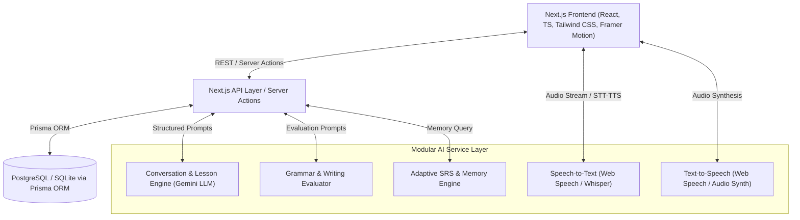

# Implementation Plan — AI Language Learning Platform ("LingoWorld / VivaLang")

> **Core Philosophy**: *"Don't just study a language. Live it."*

This document outlines the architecture, database schema, design system, AI pipeline, real-time voice pipeline, folder structure, API design, and phased execution plan for a production-ready AI language-learning platform.

---

## 1. System Architecture Overview

The platform uses a modern, modular full-stack architecture built on Next.js (App Router), TypeScript, Tailwind CSS, Prisma ORM, PostgreSQL/SQLite, and a decoupled AI service layer.



---

## 2. Database Schema (Prisma Data Model)

Below is the relational entity model designed to support multi-language progress, AI memory, scenarios, vocabulary mastery, personal notes, and analytics.

```prisma
// Core User & Auth
model User {
  id              String         @id @default(uuid())
  email           String         @unique
  name            String?
  avatar          String?
  nativeLanguage  String         @default("en")
  activeLanguage  String         @default("fr") // Default target language
  dailyGoalMin    Int            @default(15)
  streakDays      Int            @default(0)
  lastActiveAt    DateTime       @updatedAt
  createdAt       DateTime       @default(now())

  languages       UserLanguage[]
  progress        UserProgress[]
  vocabulary      UserVocabulary[]
  notes           Note[]
  conversations   Conversation[]
  activities      DailyActivity[]
  achievements    UserAchievement[]
  memories        LearnerMemory[]
}

// User-Language Progression (Supports multi-language per user)
model UserLanguage {
  id           String   @id @default(uuid())
  userId       String
  languageCode String   // e.g. "fr", "de", "es", "ja"
  cefrLevel    String   // "A1", "A2", "B1", "B2", "C1", "C2"
  xp           Int      @default(0)
  isCurrent    Boolean  @default(false)

  user         User     @relation(fields: [userId], references: [id], onDelete: Cascade)
  @@unique([userId, languageCode])
}

// Structured Curriculum & Lessons
model Language {
  code        String   @id // "fr", "de", "es", etc.
  name        String
  flag        String
  themeColor  String
  courses     Course[]
  characters  AiCharacter[]
  scenarios   Scenario[]
}

model Course {
  id           String   @id @default(uuid())
  languageCode String
  cefrLevel    String   // A1, A2, etc.
  title        String
  description  String
  order        Int

  language     Language @relation(fields: [languageCode], references: [code])
  lessons      Lesson[]
}

model Lesson {
  id          String   @id @default(uuid())
  courseId    String
  title       String
  topic       String
  order       Int
  content     String   // JSON structure containing vocabulary, grammar rules, exercises

  course      Course   @relation(fields: [courseId], references: [id])
  userProgress UserProgress[]
}

model UserProgress {
  id          String   @id @default(uuid())
  userId      String
  lessonId    String
  completed   Boolean  @default(false)
  score       Int      @default(0)
  completedAt DateTime?

  user        User     @relation(fields: [userId], references: [id], onDelete: Cascade)
  lesson      Lesson   @relation(fields: [lessonId], references: [id], onDelete: Cascade)
}

// AI Characters & Real-World Scenarios
model AiCharacter {
  id           String   @id @default(uuid())
  languageCode String
  name         String   // e.g., "Marie", "Julien"
  avatar       String
  role         String   // e.g., "Friendly local", "Barista", "Hotel Receptionist"
  personality  String
  speakingRate Float    @default(1.0)
  difficulty   String   // "BEGINNER", "INTERMEDIATE", "ADVANCED"
  systemPrompt String

  language     Language @relation(fields: [languageCode], references: [code])
  conversations Conversation[]
}

model Scenario {
  id           String   @id @default(uuid())
  languageCode String
  title        String   // "Café Order", "Hotel Check-in", "Doctor Visit"
  icon         String
  description  String
  setting      String
  initialPrompt String
  difficulty   String

  language     Language @relation(fields: [languageCode], references: [code])
  conversations Conversation[]
}

// AI Conversations & Feedback Reports
model Conversation {
  id           String   @id @default(uuid())
  userId       String
  characterId  String?
  scenarioId   String?
  languageCode String
  topic        String
  correctionMode String @default("NORMAL") // GENTLE, NORMAL, TEACHER
  createdAt    DateTime @default(now())

  user         User         @relation(fields: [userId], references: [id], onDelete: Cascade)
  character    AiCharacter? @relation(fields: [characterId], references: [id])
  scenario     Scenario?    @relation(fields: [scenarioId], references: [id])
  messages     Message[]
  report       ConversationReport?
}

model Message {
  id             String   @id @default(uuid())
  conversationId String
  sender         String   // "USER" or "AI"
  text           String
  translation    String?
  audioUrl       String?
  corrections    String?  // JSON feedback if user made grammar/vocab errors
  createdAt      DateTime @default(now())

  conversation   Conversation @relation(fields: [conversationId], references: [id], onDelete: Cascade)
}

model ConversationReport {
  id             String   @id @default(uuid())
  conversationId String   @unique
  speakingScore  Int
  grammarScore   Int
  vocabScore     Int
  pronunciationScore Int
  newExpressions String   // JSON array
  mistakesSummary String  // JSON array
  recommendations String  // JSON array

  conversation   Conversation @relation(fields: [conversationId], references: [id], onDelete: Cascade)
}

// Vocabulary & Spaced Repetition (SRS)
model UserVocabulary {
  id           String   @id @default(uuid())
  userId       String
  languageCode String
  word         String
  translation  String
  partOfSpeech String?
  exampleSentence String?
  mastery      Int      @default(0) // 0 - 100%
  nextReviewAt DateTime @default(now())
  intervalDays Int      @default(1)

  user         User     @relation(fields: [userId], references: [id], onDelete: Cascade)
}

// Personal Notes & AI Assistant
model Note {
  id           String   @id @default(uuid())
  userId       String
  languageCode String
  title        String
  category     String   // "VOCAB", "GRAMMAR", "CULTURE", "PERSONAL"
  content      String   // Markdown format
  createdAt    DateTime @default(now())
  updatedAt    DateTime @updatedAt

  user         User     @relation(fields: [userId], references: [id], onDelete: Cascade)
}

// AI Learner Memory Engine
model LearnerMemory {
  id           String   @id @default(uuid())
  userId       String
  languageCode String
  category     String   // "WEAKNESS", "STRENGTH", "GOAL", "PREFERENCE", "COMMON_ERROR"
  fact         String   // e.g., "Confuses past tense with 'avoir' and 'être'"
  confidence   Float    @default(0.8)
  updatedAt    DateTime @updatedAt

  user         User     @relation(fields: [userId], references: [id], onDelete: Cascade)
}

// Progress Analytics & Achievements
model DailyActivity {
  id           String   @id @default(uuid())
  userId       String
  date         DateTime @default(now())
  listeningMin Int      @default(0)
  speakingMin  Int      @default(0)
  vocabMin     Int      @default(0)
  writingMin   Int      @default(0)

  user         User     @relation(fields: [userId], references: [id], onDelete: Cascade)
}

model UserAchievement {
  id            String   @id @default(uuid())
  userId        String
  achievementId String
  unlockedAt    DateTime @default(now())

  user          User     @relation(fields: [userId], references: [id], onDelete: Cascade)
}
```

---

## 3. Main User Flows

1. **Interactive Onboarding & Assessment**:
   - Language choice (French, German, Spanish, etc.)
   - Goal setting (Travel, Career, Hobby, etc.)
   - Interactive placement test -> Calculates CEFR Level (e.g. A2)
   - Setup daily practice target (e.g. 15 mins/day).

2. **Daily Action Center (Home Dashboard)**:
   - Dynamic recommendation banner ("You confuse *avoir* and *être*—let's practice!").
   - Learning path progress map.
   - Quick launch AI Conversation Room, Daily Mission, SRS Flashcard Review, and Notes.

3. **Language World Exploration**:
   - Visual map of units & real-world scenarios (Café, Airport, Hotel).
   - Character hubs with distinct avatars and difficulty settings.

4. **AI Conversation Room Experience**:
   - Mode switcher: Gentle, Normal, Teacher.
   - Integrated Speech-to-Text & Text-to-Speech audio engine with visual waveform state indicators (Listening, Thinking, Speaking).
   - Post-conversation instant AI diagnostic report (Speaking %, Grammar %, Vocabulary %, Pronunciation %).

5. **Personal Notes & AI Knowledge Workspace**:
   - Rich Markdown note taker.
   - One-click AI Actions: "Explain this note", "Generate Flashcards from note", "Create quiz".

6. **Immersion Mode Toggle**:
   - Dynamic UI translation adapter switching navigation & labels to target language based on proficiency level.

---

## 4. AI Engine & Modular Architecture

Rather than a monolith prompt, AI capabilities are split into focused, domain-specific modules:

| AI Service Module | Responsibilities | Output Format |
|---|---|---|
| **Conversation Partner** | Roleplays AI characters (Marie, Anna, etc.) in target language with custom tone & difficulty. | JSON: `{ replyText, translation, audioUrl, hints }` |
| **Correction Engine** | Evaluates user input for grammar, vocabulary, and naturalness based on selected mode. | JSON: `{ hasError, correctedText, explanation, grammarTip }` |
| **Learner Memory Service** | Extracts weaknesses/mistakes from conversations and persists facts into `LearnerMemory`. | JSON: `[{ category, fact, confidence }]` |
| **Lesson Generator** | Generates dynamic practice exercises targeting identified user weaknesses. | JSON: `{ exercises: [{ type, prompt, options, answer }] }` |
| **Note Assistant** | Answers questions on notes, generates flashcards, or builds quizzes. | JSON: `{ response, generatedCards, quizItems }` |
| **Writing & Grammar Diagnostic**| Provides detailed structural evaluation of written passages. | JSON: `{ score, breakdown, suggestions }` |

---

## 5. Real-Time Voice Architecture & Visual Feedback Pipeline

```
[ User Speaks ]
     │
     ▼
MediaRecorder API / Web Speech STT
     │ (Real-time transcript)
     ▼
State: LISTENING 🎙️ (Animated Waveform)
     │
     ▼
API Request to Conversation Engine (LLM + Learner Memory Context)
     │
     ▼
State: THINKING 🤔 (Pulse Halo Animation)
     │
     ▼
LLM Response + Text-to-Speech Synthesis (Web Speech API / Neural Audio)
     │
     ▼
State: SPEAKING 🔊 (Dynamic Equalizer Bars)
     │
     ▼
Audio Playback + Synchronized Subtitles & Grammar Feedback Pill
```

---

## 6. Design System & Theme Principles

- **Aesthetic**: Premium Dark / Light Mode with Glassmorphism, subtle micro-animations (Framer Motion), crisp typography (Outfit / Inter), and language-specific visual themes:
  - 🇫🇷 **French**: Regal Navy, Azure Blue, Champagne Gold accents
  - 🇩🇪 **German**: Emerald Slate, Amber Gold, Deep Obsidian
  - 🇪🇸 **Spanish**: Sunset Coral, Terracotta, warm Gold
  - 🇯🇵 **Japanese**: Sakura Pink, Ink Black, Crimson
- **Component Guidelines**:
  - No plain generic admin controls or standard chat boxes.
  - Interactive nodes for learning paths, character avatar cards with status rings, and sleek audio wave visualizers.
  - Responsive navigation (Bottom bar on mobile, sleek sidebar on desktop).

---

## 7. Project Directory Structure

```
c:\Users\HP\Downloads\project_german/
├── public/
│   ├── flags/
│   ├── characters/
│   └── scenarios/
├── src/
│   ├── app/
│   │   ├── (auth)/
│   │   │   ├── login/
│   │   │   └── signup/
│   │   ├── (dashboard)/
│   │   │   ├── home/
│   │   │   ├── world/
│   │   │   ├── lessons/
│   │   │   ├── [lessonId]/
│   │   │   ├── conversation/
│   │   │   │   ├── room/
│   │   │   │   └── report/
│   │   │   ├── scenarios/
│   │   │   ├── vocabulary/
│   │   │   ├── notes/
│   │   │   ├── progress/
│   │   │   └── profile/
│   │   ├── onboarding/
│   │   ├── api/
│   │   │   ├── ai/
│   │   │   │   ├── conversation/
│   │   │   │   ├── evaluate-writing/
│   │   │   │   ├── generate-quiz/
│   │   │   │   └── analyze-notes/
│   │   │   ├── lessons/
│   │   │   ├── vocabulary/
│   │   │   ├── notes/
│   │   │   └── user/
│   │   ├── layout.tsx
│   │   ├── page.tsx (Landing Page)
│   │   └── globals.css
│   ├── components/
│   │   ├── ui/ (Buttons, Cards, Modals, Badges, Tabs)
│   │   ├── layout/ (Sidebar, Navbar, MobileNav, ImmersionProvider)
│   │   ├── home/ (DailyRecommendation, SkillRadar, MissionCard)
│   │   ├── world/ (LanguageCard, UnitNode, CharacterCard, ScenarioCard)
│   │   ├── conversation/ (VoiceVisualizer, ChatBubbles, ModeToggle, FeedbackReport)
│   │   ├── vocabulary/ (Flashcard, SRSReviewer, WordMasteryBadge)
│   │   └── notes/ (NoteEditor, AiNotesPanel, QuizModal)
│   ├── lib/
│   │   ├── ai/ (gemini.ts, prompts.ts, memoryEngine.ts)
│   │   ├── db/ (prisma.ts)
│   │   ├── srs/ (spacedRepetition.ts)
│   │   ├── immersion/ (translationDictionary.ts)
│   │   └── utils.ts
│   ├── types/
│   │   └── index.ts
│   └── data/
│       ├── languages.ts
│       ├── lessonsData.ts
│       ├── charactersData.ts
│       └── scenariosData.ts
├── prisma/
│   └── schema.prisma
├── package.json
├── tailwind.config.js
└── tsconfig.json
```

---

## 8. Proposed MVP Implementation Plan (Phase 1)

### Phase 1 Vertical Slice Focus:
- Full support for **French (A1 / A2)** and **German (A1)**.
- **Onboarding Flow**: Goal selection, level assessment.
- **Home Dashboard**: Adaptive recommendations, progress metrics, daily mission.
- **Language World**: Curriculum path with interactive lesson engine (vocab, grammar, listening, speaking exercises).
- **AI Conversation Room**:
  - Voice + Text interface with real-time waveform states (Listening, Thinking, Speaking).
  - Character selection (Marie, Julien, Anna, Lukas).
  - Real-World Scenarios (Café, Hotel, Taxi).
  - Correction Modes (Gentle, Normal, Teacher).
  - Post-conversation instant diagnostic report.
- **Vocabulary & SRS System**: Spaced repetition flashcards with mastery tracking.
- **Personal Notes Workspace**: Rich note-taking with AI Assistant ("Explain note", "Create quiz").
- **Immersion Mode**: Instant UI language switcher.
- **Responsive Layout**: Mobile navigation & sleek desktop sidebar.

---

## Proposed Next Steps

1. Create Next.js project with Tailwind CSS, TypeScript, Lucide icons, Framer Motion, and Prisma ORM setup.
2. Build seed data & mock API endpoints for offline/demo reliability alongside real Gemini AI pipelines.
3. Construct the shared design system & Immersion mode translation context.
4. Implement all 26+ UI screens with full interactive functionality.
5. Perform end-to-end verification and visual check.
